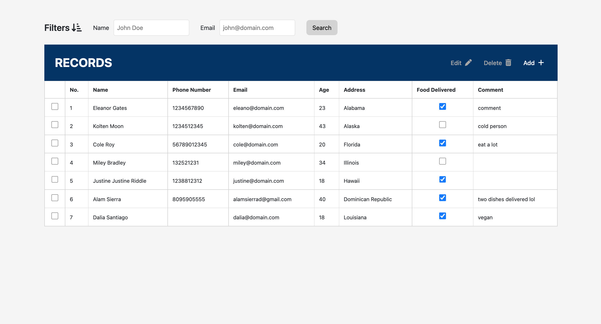
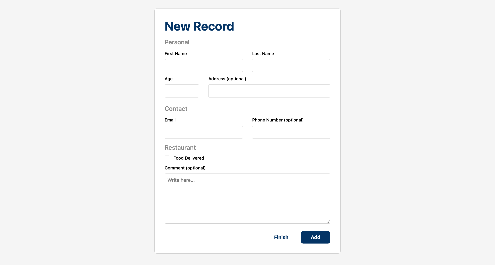
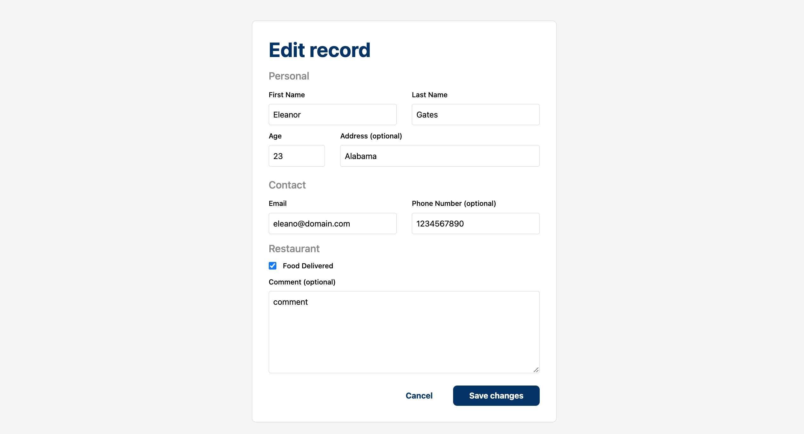
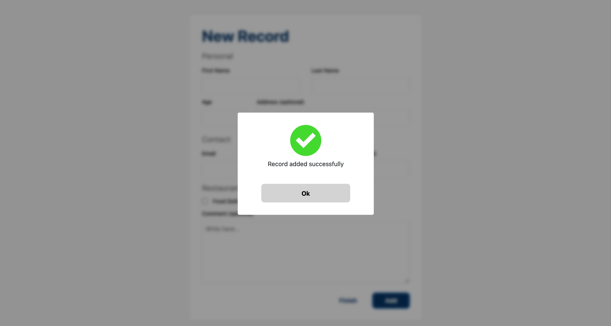
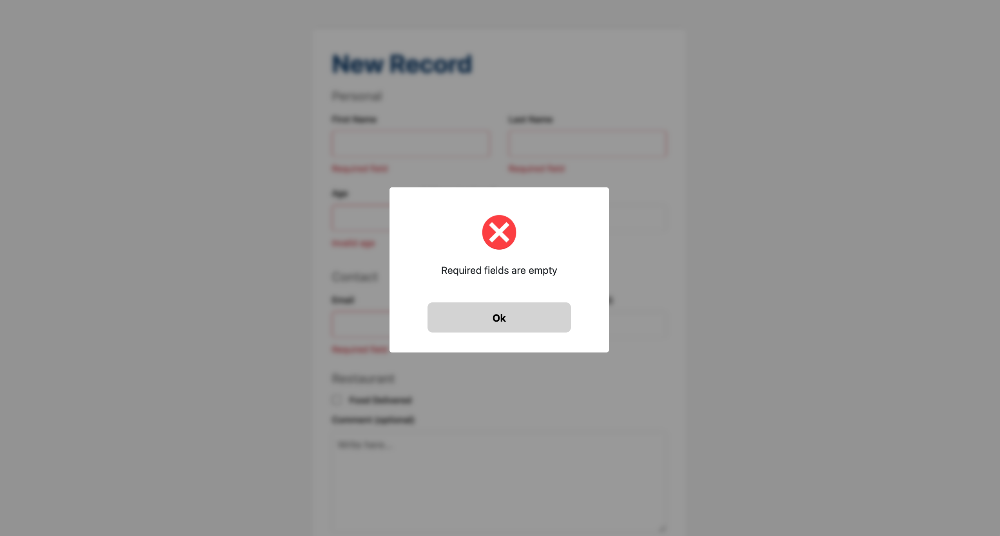

# Lunch Records

Web application whose purpose is to manage the information of the residents who will receive a free lunch in a restaurant.

## Features

- Lunch records table
- Filter by name and email
- New records form
- Save data locally

## Tech Stack

**React:**
Component based library used to make this SPA.

**React Router:**
Render components based on routes.

**Typescript:** Extends Javascript with a type system.
Help me to write less error prone code.

**Bootstrap:** For styles.

**React Bootstrap:**
Extract pre-built component with bootstrap classes.

**Styled components:**
Create styled HTML elements and use them as components.

## Run Locally

Clone the project

```bash
  git clone https://github.com/Almsrr/lunch-records.git
```

Go to the project directory

```bash
  cd lunch-records
```

Install dependencies

```bash
  yarn install
```

Start the server

```bash
  yarn start
```

## Screenshots



Home page with a grid containing all the information (records) collected from residents.

At the top end you can filter these records by name (first name/last name) and email.

In the grid header (blue) there are two options that will allow you make interesting things:

**Edit:**
This option will be available if only one record is selected, and when you click on it, it sends you a complete form with the information of the selected record.

**Delete:**
Delete option will always be available. You can delete more than one record at the same time.

**Add:**
Add option will always be available as well. It sends you a empty form waiting for be validated and completed.

Last but not least you can update the Food Delivered field of a record just by checking or unchecking in the "Food Delivered" column.



A form to add records.



A filled form to edit specific record.

### Modals

During the use of the application some types of modals are triggered. These are just two of them. I recommend you use the app.




